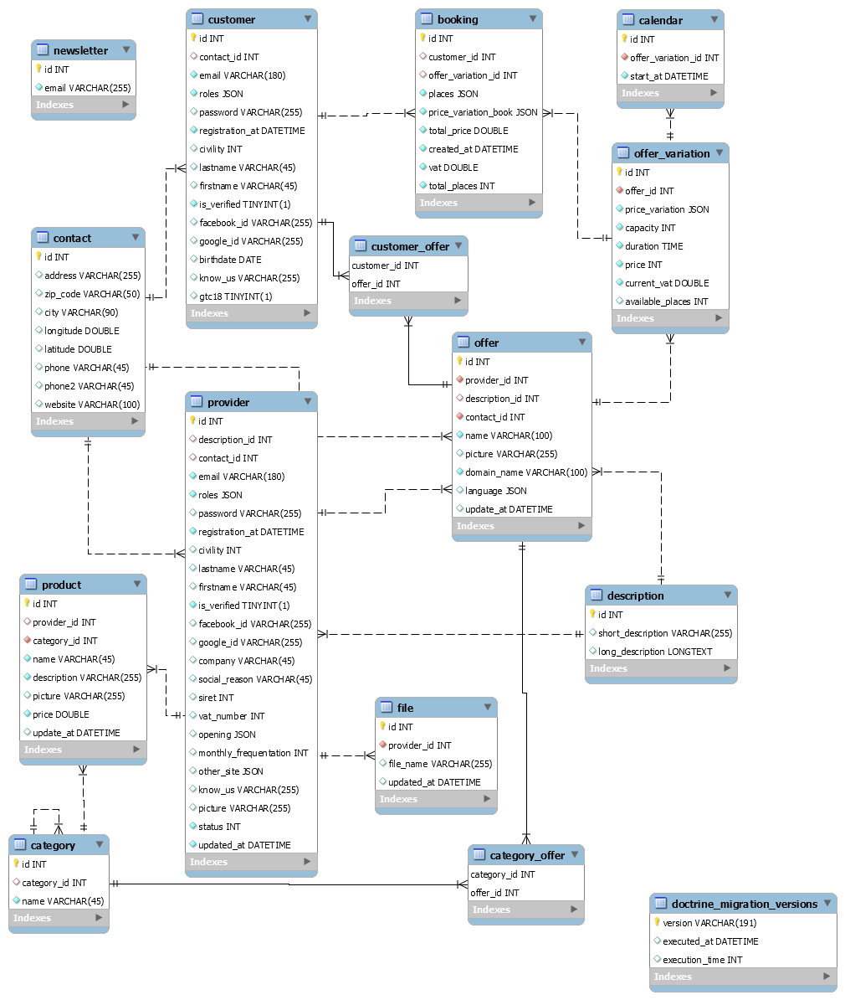

## Getting Started for Students

### Prerequisites

1. Check composer is installed
2. Check yarn & node are installed

### Install

1. Clone this project
2. Run `composer install`
3. Run `yarn install`
4. Run `yarn encore dev` to build assets

### Working

1. Run `symfony server:start` to launch your local php web server
2. Run `yarn run dev --watch` to launch your local server for assets

### Testing

1. Run `.vendor/bin/phpcs` to launch PHP code sniffer
2. Run `.vendor/bin/phpstan analyse src --level max` to launch PHPStan
3. Run `.vendor/bin/phpmd src text phpmd.xml` to launch PHP Mess Detector
3. Run `./node_modules/.bin/eslint assets/js` to launch ESLint JS linter
3. Run `../node_modules/.bin/sass-lint -c sass-linter.yml -v` to launch Sass-lint SASS/CSS linter

## Deployment

To deploy on Cap Rover, follow [instructions in the manual](https://caprover.com/docs/get-started.html) and add, at least, two  *"Environmental Variables"* in *"App Configs"*  tab:

* `APP_ENV` with `prod`/`dev` value
* `DATABASE_URL` with the connection informations given by caprover when you create the related DB app.

Caprover configuration files are : 

* [captain-definition](https://github.com/WildCodeSchool/sf4-pjt3-starter-kit/blob/master/captain-definition) Caprover entry point
* [Dockerfile](https://github.com/WildCodeSchool/sf4-pjt3-starter-kit/blob/master/Dockerfile) Web app configuration for Docker container
* [docker-compose.yml](https://github.com/WildCodeSchool/sf4-pjt3-starter-kit/blob/master/docker-compose.yml) ...not use it's used 😅
* [docker-entry.sh](https://github.com/WildCodeSchool/sf4-pjt3-starter-kit/blob/master/docker-entry.sh) shell instruction to execute when docker image is built
* [nginx.conf](https://github.com/WildCodeSchool/sf4-pjt3-starter-kit/blob/master/nginx.conf) Nginx server configuration
* [php.ini](https://github.com/WildCodeSchool/sf4-pjt3-starter-kit/blob/master/php.ini) Php configuration

## Built With

* [Symfony](https://github.com/symfony/symfony)
* [GrumPHP](https://github.com/phpro/grumphp)
* [PHP_CodeSniffer](https://github.com/squizlabs/PHP_CodeSniffer)
* [PHPStan](https://github.com/phpstan/phpstan)
* [PHPMD](http://phpmd.org)
* [ESLint](https://eslint.org/)
* [Sass-Lint](https://github.com/sasstools/sass-lint)

## Schema de la base de donnée

## Connexion Facebook

Créer une application sur https://developers.facebook.com/  
Ajouter les identifiants dans .env  
FACEBOOK_ID=    
FACEBOOK_SECRET=

## Connexion Google

Créer une application sur https://console.developers.google.com/    
Ajouter les identifiants dans .env  
GOOGLE_ID=  
GOOGLE_SECRET=  